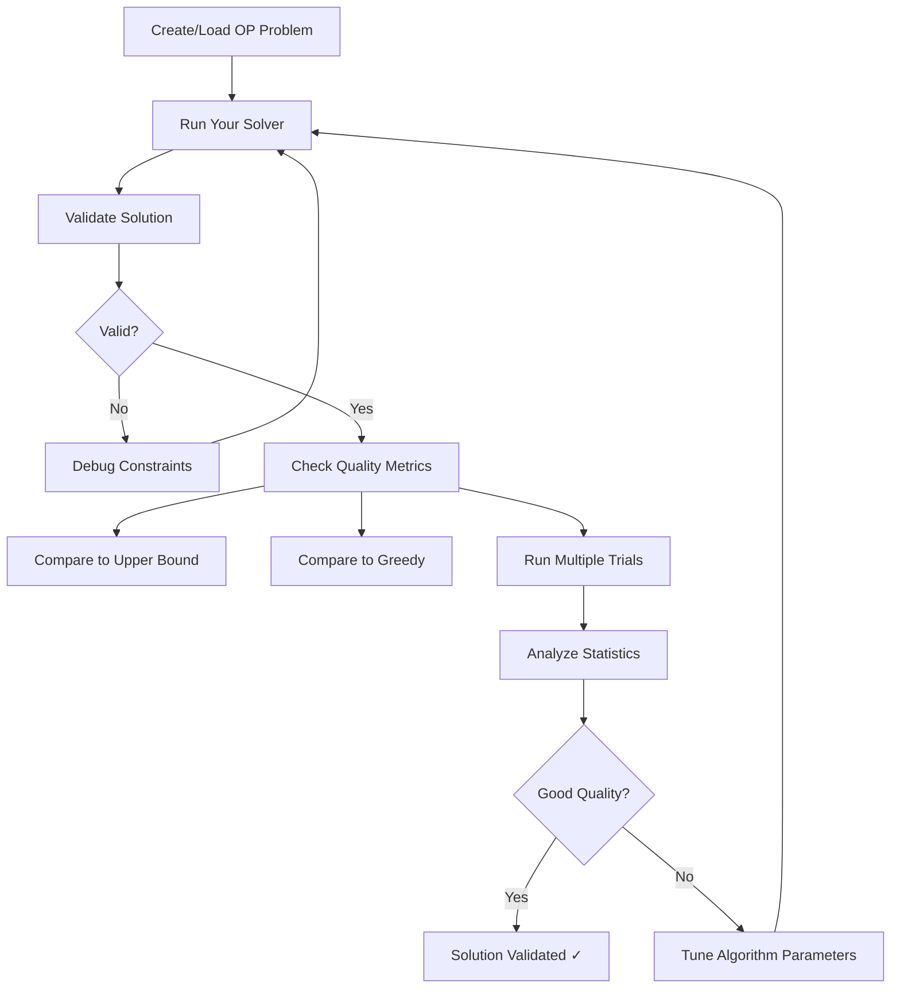

# Solution Validation Guide for Orienteering Problem

This guide explains how to validate that your Orienteering Problem (OP) solutions are correct and of good quality.

## 📋 Quick Start

### 1. Basic Validation (Check if solution is valid)

```bash
# Validate a specific solution path
python validate_solution.py OP_Benchmark_Set/set_64_1/set_64_1_80.txt "0,5,12,7,1"

# Run greedy baseline (no solution provided)
python validate_solution.py OP_Benchmark_Set/set_64_1/set_64_1_80.txt
```

### 2. Statistical Analysis (Run multiple trials)

```bash
# Run 20 trials and get statistics
python benchmark_solution.py OP_Benchmark_Set/set_64_1/set_64_1_80.txt 20
```

---

## 🔍 What Gets Validated?

The validation tools check:

1. **Path Structure**
   - ✓ Starts at node 0 (START_NODE)
   - ✓ Ends at node 1 (END_NODE)
   - ✓ No repeated nodes (each visited once)
   - ✓ All nodes exist in the problem

2. **Budget Constraint**
   - ✓ Total path distance ≤ budget
   - ✓ Shows slack (remaining budget)

3. **Edge Constraints** (if `max_edge_distance` is set)
   - ✓ Each edge distance ≤ max_edge_distance
   - ✓ Each node is reachable from previous (respects graph structure)

4. **Quality Metrics**
   - Total reward collected
   - Budget utilization %
   - Comparison to upper bound
   - Comparison to greedy baseline

---

## 📊 How to Evaluate Solution Quality

### Method 1: Upper Bound Comparison

The **upper bound** is a theoretical maximum calculated by greedily selecting the highest-scoring nodes (ignoring routing constraints).

**Good solution**: Gets within 10-30% of upper bound  
**Excellent solution**: Gets within 5-10% of upper bound

```python
# The validation tool automatically calculates this
Optimality Gap: 15.2% (lower is better)
```

### Method 2: Greedy Baseline Comparison

Compare against a simple greedy algorithm (nearest high-value neighbor).

**Good solution**: Beats greedy by 10-50%  
**Excellent solution**: Beats greedy by 50%+

```python
Greedy Baseline: 850
Your Solution: 1150
Improvement over Greedy: +35.3%
```

### Method 3: Statistical Consistency

Run your algorithm multiple times (e.g., 10-20 trials):

```python
Mean Reward: 1150 ± 45
Coefficient of Variation: 3.9%  # Lower = more consistent
```

**Good algorithm**: CV < 10% (consistent results)  
**Needs improvement**: CV > 20% (highly variable)

---

## 🛠️ Integration with Your MCTS Solver

### Step 1: Wrap Your Solver

Create a wrapper function that takes `OrienteeringProblem` and returns `(path, reward)`:

```python
# Example: Integrate with your WU-UCT implementation
from MCTS.wu_uct_demo import run_wu_uct
from benchmark_solution import run_multiple_trials, print_statistics_report

def my_solver(problem):
    """Wrapper for your MCTS solver"""
    # Call your actual solver
    result = run_wu_uct(problem, iterations=10000, num_workers=4)
    
    # Extract path and reward
    path = result['best_path']  # Adjust to your return format
    reward = result['best_reward']
    
    return path, reward
```

### Step 2: Run Statistical Analysis

```python
from orienteering.orienteering import OrienteeringProblem

# Load problem
nodes, budget = OrienteeringProblem.load_problem('OP_Benchmark_Set/set_64_1/set_64_1_80.txt')
problem = OrienteeringProblem(nodes, budget, max_edge_distance=1.42)

# Run 10 trials
stats = run_multiple_trials(problem, my_solver, num_trials=10, 
                            algorithm_name="My WU-UCT MCTS")

# Print detailed report
print_statistics_report(stats, problem)
```

### Step 3: Compare Algorithms

```python
from benchmark_solution import compare_algorithms

algorithms = {
    'WU-UCT (4 workers)': lambda p: my_solver(p),
    'Greedy': greedy_nearest_neighbor,
    # Add more variations...
}

compare_algorithms(problem, algorithms, num_trials=10)
```

---

## 📈 Interpreting Results

### Validation Report Example

```
VALIDATION REPORT: My MCTS Solution
================================================================================

Status:              VALID ✓

Metric                      Value
--------------------------------------------------
Total Reward                1245
Total Distance              79.8432
Budget                      80.0000
Budget Used                 99.80%
Slack (remaining)           0.1568
Path Length                 12
Unique Nodes Visited        12

Path: [0, 5, 12, 7, 23, 18, 31, 29, 15, 8, 3, 1]

QUALITY METRICS
--------------------------------------------------
Upper Bound: 1450
Optimality Gap: 14.1% (lower is better)
  (Upper bound calculated by greedily selecting top nodes)

Greedy Baseline: 950
Improvement over Greedy: +31.1%
```

### What This Tells You:

✅ **Solution is valid** - meets all constraints  
✅ **99.8% budget utilization** - efficiently uses available budget  
✅ **14.1% optimality gap** - reasonably close to theoretical maximum  
✅ **31% better than greedy** - MCTS provides significant improvement

---

## 🎯 Validation Checklist for Custom Problems

When you create your own OP instances, validate them by:

### 1. Problem Structure Validation
```python
# Check your problem is well-formed
assert problem.nodes[0].id == 0  # Start node
assert problem.nodes[1].id == 1  # End node
assert problem.budget > 0
assert problem.get_distance(0, 1) <= problem.budget  # At least start→end is feasible
```

### 2. Run Known Baselines
```python
# Greedy should find SOME solution
greedy_path, greedy_reward = greedy_nearest_neighbor(problem)
validation = validate_solution(problem, greedy_path)
assert validation['is_valid'], "Greedy failed - problem may be infeasible"
```

### 3. Compare Problem Difficulty
```python
# Check upper bound vs greedy gap
upper_bound, _ = calculate_upper_bound(problem)
greedy_path, greedy_reward = greedy_nearest_neighbor(problem)

difficulty = (upper_bound - greedy_reward) / upper_bound * 100
print(f"Problem difficulty: {difficulty:.1f}%")
# 20-40% = easy, 40-60% = medium, 60%+ = hard
```

---

## 📁 Using Existing Benchmarks

You have benchmark datasets in `OP_Benchmark_Set/`. Compare your custom problems against these:

```bash
# Test on small instance (64 nodes)
python validate_solution.py OP_Benchmark_Set/set_64_1/set_64_1_80.txt

# Test on medium instance (100 nodes)
python validate_solution.py OP_Benchmark_Set/set_100_1/set_100_1_100.txt

# Test on large instance (1000 nodes)
python validate_solution.py OP_Benchmark_Set/set_1000_1/set_1000_1_100.txt
```

---

## 🔧 Advanced: Custom Validation

Add custom validation rules for your specific problem:

```python
from validate_solution import validate_solution

def validate_with_custom_rules(problem, path):
    """Add custom validation on top of standard checks"""
    
    # Standard validation
    validation = validate_solution(problem, path)
    
    # Custom rule: Must visit at least 5 nodes
    if len(set(path)) < 5:
        validation['warnings'].append("Path visits fewer than 5 unique nodes")
    
    # Custom rule: High-value nodes should be prioritized
    high_value_nodes = [n.id for n in problem.nodes if n.score > 50]
    visited_high_value = [n for n in path if n in high_value_nodes]
    if len(visited_high_value) < len(high_value_nodes) * 0.5:
        validation['warnings'].append("Missed many high-value nodes")
    
    return validation
```

---

## 📝 Summary: Validation Workflow



---

## 🚀 Quick Commands

```bash
# Single solution validation
python validate_solution.py <problem_file> "<path>"

# Benchmark with statistics
python benchmark_solution.py <problem_file> <num_trials>

# In your code
from validate_solution import validate_solution, print_validation_report
validation = validate_solution(problem, path)
if validation['is_valid']:
    print(f"Reward: {validation['total_reward']}")
else:
    print(f"Errors: {validation['errors']}")
```

---

## 📚 References

- **Orienteering Problem**: Classic combinatorial optimization problem
- **Upper Bound**: Theoretical maximum (optimistic estimate)
- **Greedy Baseline**: Simple heuristic for comparison
- **Optimality Gap**: (Upper Bound - Solution) / Upper Bound × 100%

For more help, see:
- `validate_solution.py` - Core validation logic
- `benchmark_solution.py` - Statistical analysis tools
- `orienteering/orienteering.py` - Problem definition
